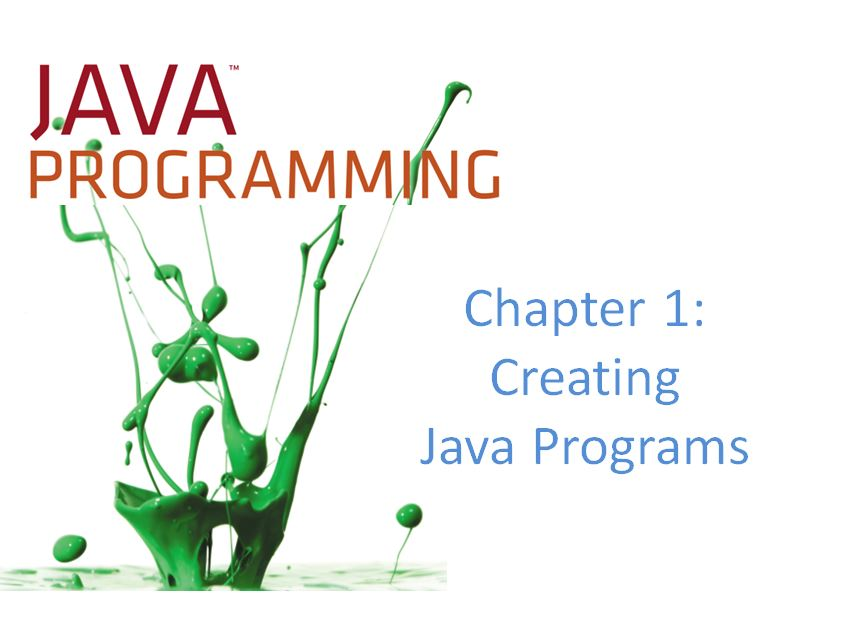

# Java Programming Chapter 1

All of this needs to be place inside your GitHub Page and inserted into GitHub
All chapter assignments must be linked inside of your README page like this.

Example of turning in Debugging excercise one <a href= https://github.com/WestJavaClass/chapter1/blob/master/FixDebugOne1.java> Here </a>

Chapter 1 assignments

Portfolio On-Line all problems and solutions must be displayed using Google Sites. 

All information must be uploaded to GitHub
Vocabulary Test due on Monday <a href=https://github.com/WestJavaClass/chapter-1/blob/master/JavaChapter1Vocab.txt>Found Here</a>
 
-Understanding Main Method Quiz due on Friday example page 19  
-Exercises 1-10 page 49 
-Game Zone page 51 #1  
-Case problem page 51 # 1-2  
-Debugging 1-4 display

